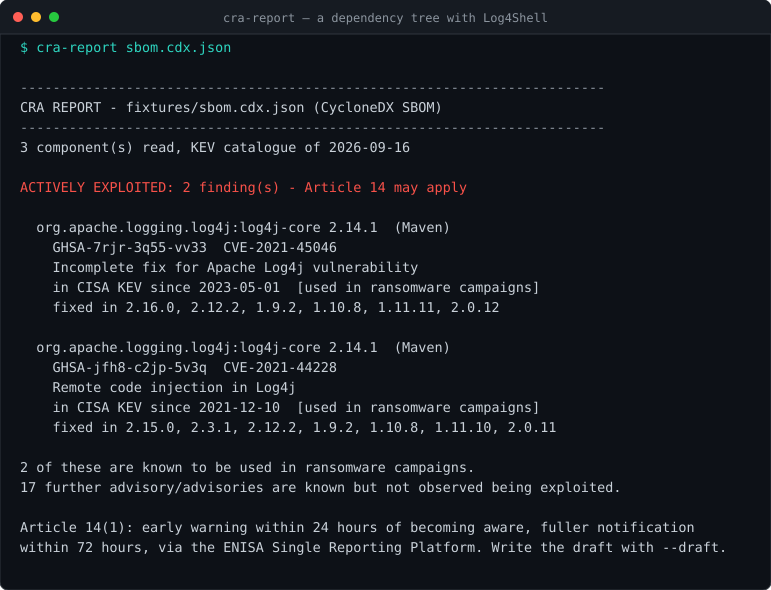

# cra-report

[](https://github.com/dkautomation23/cra-report/actions/workflows/ci.yml)
[](https://scorecard.dev/viewer/?uri=github.com/dkautomation23/cra-report)
[](https://github.com/dkautomation23/cra-report/actions/workflows/codeql.yml)
[](https://www.npmjs.com/package/cra-report)



Finds the components you ship that are **being exploited right now**, and drafts
the EU Cyber Resilience Act Article 14 notification for them.

```bash
npx cra-report package-lock.json
npx cra-report sbom.cdx.json --draft early-warning.md
```

No runtime dependencies, no API key, nothing to sign up for. TypeScript, Node's
own test runner, 34 tests.

Every published version is built and published by the workflow in this
repository, never from a laptop, and carries a provenance statement recorded in
Sigstore's public transparency log. Anyone can check that before trusting it:

```bash
npm audit signatures
```

## Why now

Since **11 September 2026**, a manufacturer placing a product with digital
elements on the EU market must notify an *actively exploited* vulnerability in it
— an early warning within **24 hours** of becoming aware, a fuller notification
within 72. Article 14 sends that notification to the CSIRT designated as
coordinator *and* to ENISA, through the single reporting platform. Machine-readable
SBOMs follow on 11 December 2027, but the clock is already running, and you cannot
meet a 24-hour deadline by starting to work out what is in your product on the day.

The hard part is not finding vulnerabilities. Any scanner will hand you a
hundred. The hard part is deciding which of them could start a statutory clock —
a different question, with a different answer, from "is it CRITICAL".

**This tool narrows the hundred to the few worth a human's attention. It does not
decide whether the clock started.** That turns on whether the affected component
is reachable in the product you placed on the market and on when you became
aware, and no tool reading a lock file can answer either. What it gives you is
the short list, with the evidence attached, fast enough to be useful inside 24
hours.

## What it actually does

Reads your components, asks [OSV](https://osv.dev) what is known about those
exact versions, and cross-references every CVE against the
[CISA KEV catalogue](https://www.cisa.gov/known-exploited-vulnerabilities-catalog)
— the list of vulnerabilities **observed being exploited in the wild**.

```console
$ cra-report sbom.cdx.json

------------------------------------------------------------------------
CRA REPORT - sbom.cdx.json (CycloneDX SBOM)
------------------------------------------------------------------------
3 component(s) read, KEV catalogue of 2026-09-16

ACTIVELY EXPLOITED: 2 finding(s) - Article 14 may apply

  org.apache.logging.log4j:log4j-core 2.14.1  (Maven)
    GHSA-jfh8-c2jp-5v3q  CVE-2021-44228
    Remote code injection in Log4j
    in CISA KEV since 2021-12-10  [used in ransomware campaigns]
    fixed in 2.15.0, 2.3.1, 2.12.2, 1.9.2, 1.10.8, 1.11.10, 2.0.11

2 of these are known to be used in ransomware campaigns.
17 further advisory/advisories are known but not observed being exploited.
```

Seventeen advisories that are ordinary maintenance, two that are not. That ratio
is the whole product — and the run above is reproducible from `fixtures/` in this
repository.

The opposite case matters just as much:

```console
$ cra-report fixtures/package-lock.json --all

No component carries a vulnerability that is known to be exploited in the wild.
(6 other advisory/advisories across 1 component(s) - ordinary maintenance,
 no Article 14 clock.)
```

Six advisories against `lodash@4.17.15`, none of them exploited. Nothing to
report, and now you can say so with a reason.

## The draft

`--draft early-warning.md` writes the Article 14(1) early warning with everything
a machine already knows filled in — component, advisory, CVE, when CISA first saw
it exploited, whether it is used in ransomware campaigns, which versions fix it,
and both deadlines counted from now. What it cannot know is marked
**TO COMPLETE**:

- whether the affected code is reachable in your product;
- what corrective or mitigating measures you have taken;
- who your users are and whether they have been told.

It is a draft, not a submission. Article 14 notifications are filed through the
**ENISA Single Reporting Platform** and no other channel — not by email, not to a
national portal.

## In CI, and in cron

```yaml
- run: npx cra-report package-lock.json --draft early-warning.md
```

Exit code is `1` when something exploited is found, `0` when nothing is, `2` when
the tool could not do its job. A nightly cron with the same line is the cheaper
half: a component that was clean yesterday can enter the KEV catalogue overnight,
and the 24 hours start when you become aware — which is a reason to look every
day rather than a reason to look away.

## Input

| Input | Notes |
| --- | --- |
| CycloneDX SBOM (JSON) | The format the regulation points at; read through `purl` |
| SPDX SBOM (JSON) | Read through the `purl` external refs |
| `package-lock.json` | Workspace links and the project itself are skipped |
| `Cargo.lock` | No TOML dependency: the file only ever has one shape |
| `requirements.txt` | **Pinned lines only.** A range does not say what is installed, and the count of skipped lines is printed rather than hidden |

Ecosystems: npm, PyPI, crates.io, Go, Maven, NuGet, RubyGems, Packagist.

| Flag | Meaning |
| --- | --- |
| `--draft FILE` | Write the Article 14(1) early-warning draft |
| `--json FILE` | Every finding, machine-readable |
| `--kev FILE` | Use a saved KEV feed instead of fetching (air-gapped, or reproducing a past run) |
| `--all` | Also list the advisories that are not being exploited |
| `--timeout MS` | Per request, default 30000 |
| `--quiet` | Write the files, print nothing |

## Install

```bash
npx cra-report --help          # nothing to install

git clone https://github.com/dkautomation23/cra-report.git
cd cra-report && npm install && npm test
```

Node 22+. The test suite replays recorded API responses, so it passes with no
network at all.

## Fuzzed, and it found two real ones

The input to this tool is always a file something else generated: an SBOM from
a build system, a lock file from a package manager, a KEV feed fetched from
CISA. A report a regulator may read must not turn into a stack trace because a
field held an object where a list was expected.

```bash
npm run build
mkdir -p fuzz/corpus   # libFuzzer writes what it grows into the FIRST directory
npx jazzer fuzz/parse.fuzz.js fuzz/corpus fuzz/seeds --sync -- -max_total_time=150
```

The first run, on 21 September 2026, found two crashes in under twenty thousand
executions:

- **`packages: {}` instead of `[]`** — `for...of` threw `object is not
  iterable`. A valid `package-lock.json` handed to the SPDX reader was enough
  to trigger it, and the message told the holder of a broken SBOM nothing.
  Every reader now treats a wrong shape as zero components, which is true and
  actionable.
- **`decodeURIComponent` on a purl** — a lone `%` or `%zz` in a package name
  throws `URIError`, ending a report covering a hundred other components. The
  undecoded name is kept instead: visibly odd in the output, which is the right
  outcome for a name that could not be read.

Both are now regression tests. After the fixes: **2,000,000 executions in 92
seconds, no crash.** Runs for sixty seconds in CI on every push, in the ordinary test workflow.
Not through ClusterFuzzLite: it supports c, c++, go, rust, python, jvm and
swift, and this is JavaScript. Two commits went into arguing with its
sanitizer setting before anyone checked whether the language was on the list.
The target is [`fuzz/parse.fuzz.js`](fuzz/parse.fuzz.js).

## Honest limits

This is the part that matters in a compliance tool, so it is longer than usual.

- **It does not tell you whether you must report.** That turns on whether the
  affected code is reachable in your product and whether you are the manufacturer
  placing it on the EU market. No tool can answer either from a lock file. What
  this does is narrow a hundred advisories to the two worth waking someone for.
- **KEV is a floor, not a ceiling.** A vulnerability can be exploited in the wild
  before CISA lists it, and the CRA's obligation is about exploitation, not about
  the catalogue. A quiet result means "nothing *known* to be exploited", which is
  not the same as "nothing is".
- **KEV leans towards vendor products.** Log4j, Spring, Citrix, Fortinet. Small
  npm and PyPI libraries appear in it far less often, so a pure-JavaScript
  dependency tree will frequently come back quiet — correctly, and less
  informatively than a Java or Go one.
- **Only direct components in the file you give it.** Vendored code, system
  packages, base images and anything installed outside the manifest are invisible.
  An SBOM built from the running artefact covers more than a lock file does.
- **Unpinned requirements are skipped, loudly.** Guessing which version a range
  resolved to would be a fabrication in a document a regulator may read.
- **It stores nothing and sends nothing.** Your component list goes to osv.dev to
  be answered, KEV is a public file, and nothing else leaves the machine.
- **Not legal advice.** It is a tool that reads two public feeds. Whether and what
  to notify is a decision for your organisation.
- **This repository's own Scorecard reports fourteen vulnerabilities, and that
  is the fixtures.** `fixtures/sbom.cdx.json` names log4j-core 2.14.1, lodash
  4.17.15 and requests 2.31.0 on purpose — a report generator with nothing to
  report demonstrates nothing — and a scanner walking the repository reads them
  as this project's own bill of materials. Nothing shipped here depends on any
  of them: `npm audit` and `npm audit --omit=dev` both report zero. The
  fourteen are listed one by one with a reason in
  [`osv-scanner.toml`](osv-scanner.toml) rather than deleted, because deleting
  them would remove the only worked example in this README. It is the same
  class of mistake this tool exists to prevent, arriving from the other
  direction: a scanner cannot tell a dependency from a test input, and a score
  built on that distinction has to be read rather than believed.

## Licence

MIT
